# FlowChar-基本语法

## Graph

* 本节讨论graph这种布局模式，这种模式是从上到下的布局

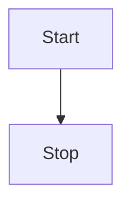

1. 本节讨论的是从做到右
2. 关于布局可以有以下选项可供配置:
* TB-top bottom
* BT-bottom top
* RL-right left
* LR-left right
* TD-same as TB

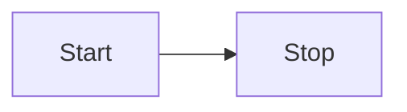

## 节点和形状

* 默认的节点

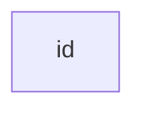

* 拥有描述的文字的节点

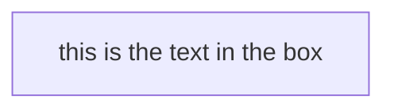

* 拥有形状的节点

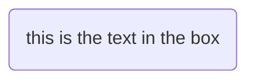

* 一个圆形的节点

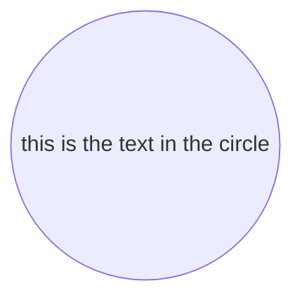

* 一个不对称的形状

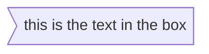

* 一个菱形

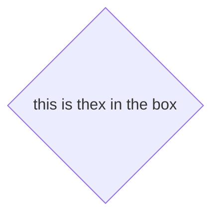

## 节点之间的连接

* 不同节点之间可以使用连接/边线 进行连接，mermaid提供不同的样式  
* 箭头符号

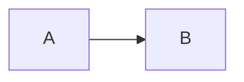

* 不带箭头的符号

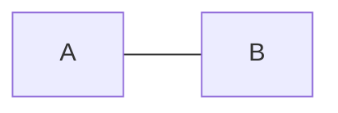

* 不带箭头连接上有文字

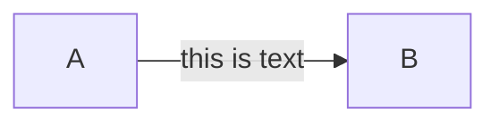

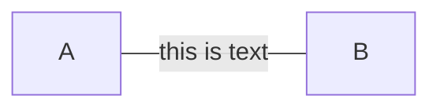

* 带箭头连接上有文字

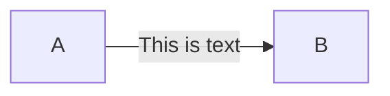

* 虚线带文字

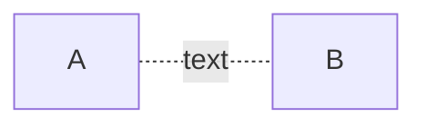

* 实线带文字  

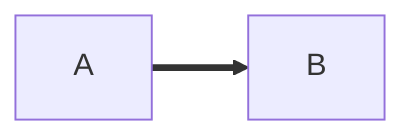

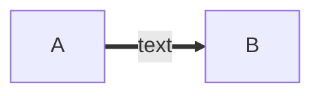

* 对于fontawesome基础的支持，通过如下语法：fa:#icon class name#.

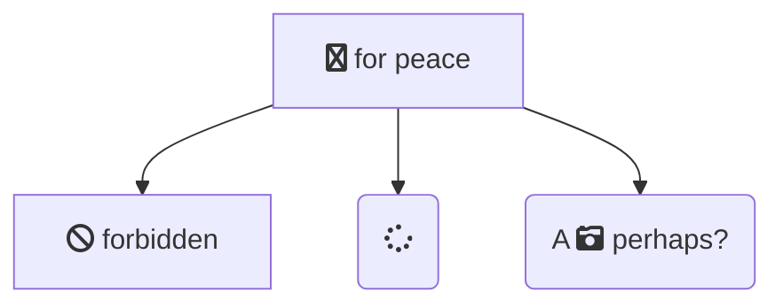

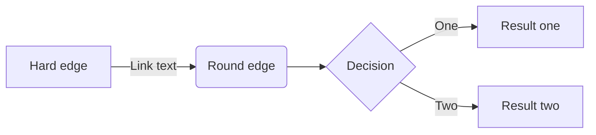

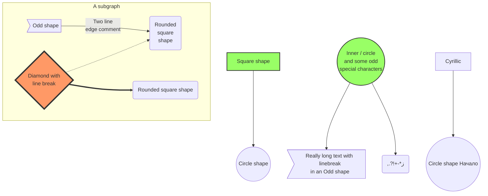