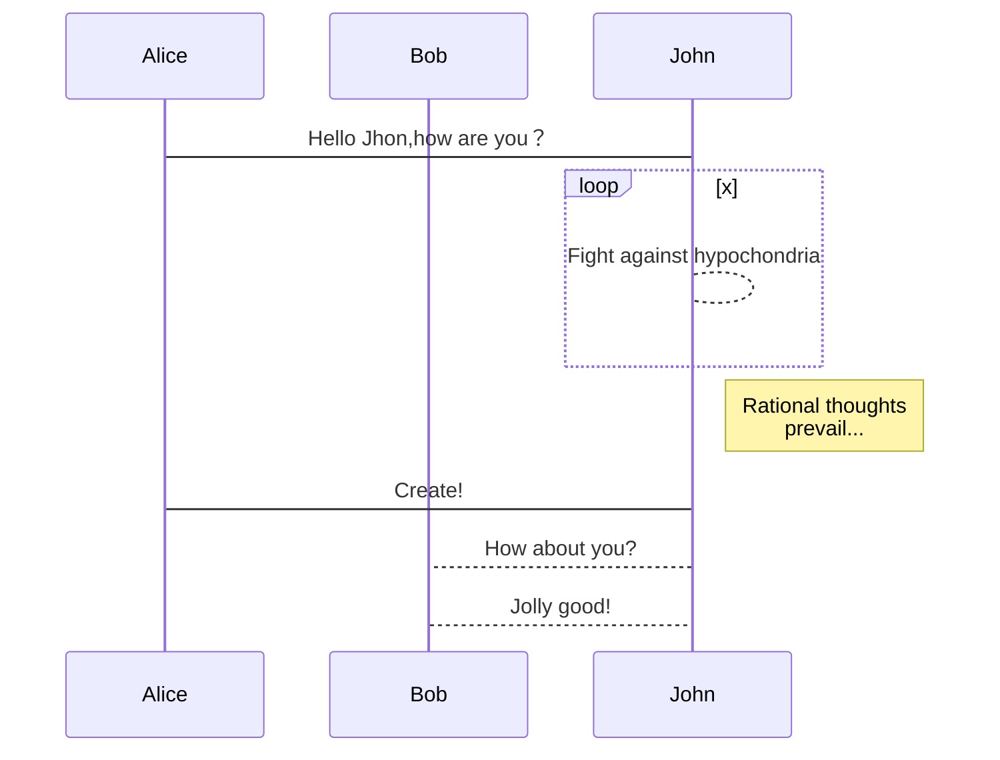
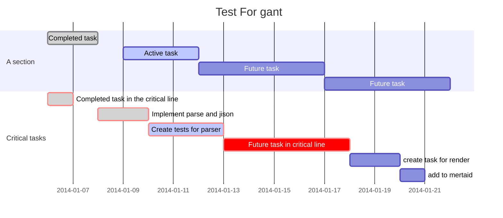

# 官网

[官网链接](https://mermaidjs.github.io/)

## mermaid 的目标

* 就像markdown一样简单的以文本的方式生成图表和流程图  

## Examples

* flowchart

```mermaid
graph TD;
    A-->B;
    A-->C;
    B-->D;
    C-->D;
```

---

* sequence diagram

```mermaid
sequenceDiagram
    participant Alice
    participant Bob
    Alice->John:Hello Jhon,how are you？
    loop x
        John-->John: Fight against hypochondria
    end
    Note right of John:Rational thoughts <br/> prevail...
    John->Alice:Create!
    John-->Bob:How about you?
    Bob--> John: Jolly good!
```

---

* gantt diagram

```mermaid
gantt
    dateFormat YYYY-MM-DD
    title Test For gant
    section A section
    Completed task :done, desc1, 2014-01-06,2014-01-08
    Active task :active,desc2,2014-01-09,3d
    Future task :desc3,after desc2,5d
    Future task :desc4,after desc3,5d  
    section Critical tasks
    Completed task in the critical line:crit,done,2014-01-06,24h
    Implement parse and jison:crit,done,after desc1,2d
    Create tests for parser:crit,active,3d
    Future task in critical line:crit,5d
    create task for render:2d
    add to mertaid:1d
```