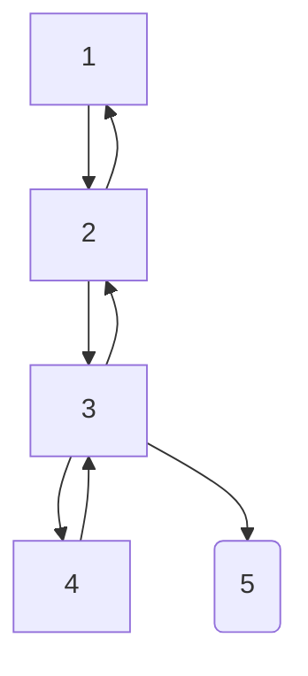
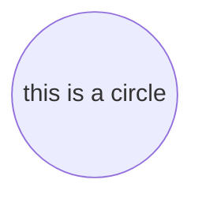

```mermaid
graph TD;
    A-->B;
    A-->C;
    B-->D;
    C-->D;
```  

```mermaid
graph TD;
    1-->2;
    2-->3;
    3-->4;
    3-->graphLR(5);
    4-->3;
    3-->2;
    2-->1;
```

```mermaid
graph LR
    id((this is a circle))
```